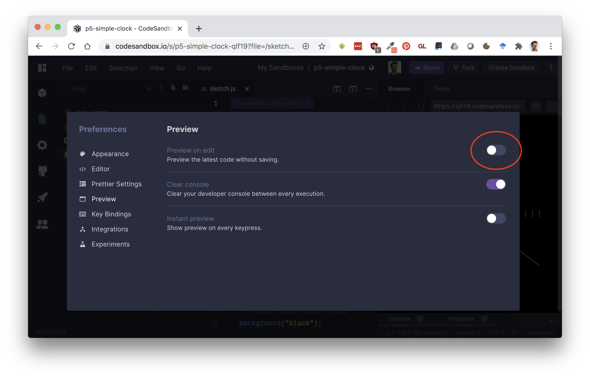
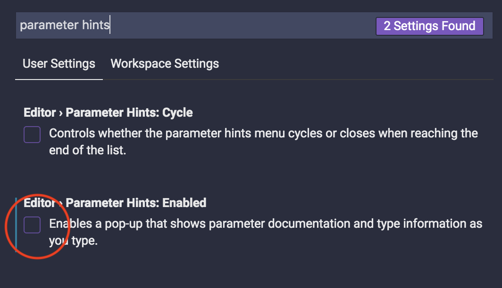
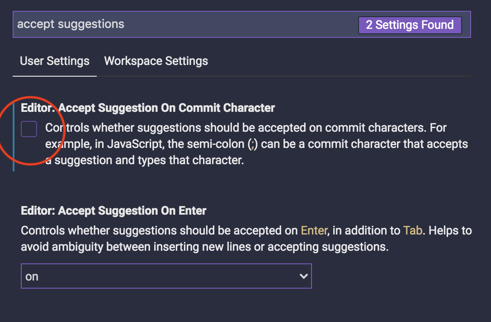

#### :closed_book: [workshop-data-artwork](../README.md) → Setting Up CodeSandbox

---

# Setting Up CodeSandbox

### 1. Register a GitHub Account

For this workshop, you'll need a [GitHub](https://github.com/) account. It's free, and you'll probably use it again if you plan to continue coding.

### 2. Sign into CodeSandbox

Next, open [CodeSandbox](https://codesandbox.io/dashboard) and Sign In for the first time by authenticating your GitHub account.

Once you sign in, start by opening a template you'd like to edit, like this p5.js starter:

- [p5-template](https://codesandbox.io/s/p5-template-woe6w?file=/sketch.js)

### 3. Disable Preview on Edit

To improve performance when working with p5.js, we will disable the CodeSandbox **Preview on Edit** feature.

Open **File > Preferences > CodeSandbox Settings** and choose Preview, then uncheck "Preview on edit".

### 4. Disable Code Hinting

> Note: You may want to re-enable this later if you are using CodeSandbox for other work.

Some of the editor hints can be a little confusing, and won't work with p5.js, so I'm going to disable them for the workshop, and I'd advise you to do the same.

First, go to **File > Preferences > Settings**.

In the *Search Settings* bar, type **parameter hints** and uncheck **Parameter Hints: Enabled**.

Next, search for **accept suggestions** and uncheck **Accept Suggestions on Commit Character**.

Now close the settings tab and reload the browser page, and it should be applied across all your CodeSandbox projects.

### 5. Fork!

Next, you can click the big "Fork" button in the top right of a template in order to remix and save it. See the [README.md](../README.md) for a list of all the templates for the workshop.

### 6. (Optional) Choose a Pretty Theme

If you want, you can browse some other editor themes by selecting **File > Preferences > Color Theme** and then using the Up or Down arrow keys.

### Tip: Downloading Your Project

You can always download your entire project as a ZIP file and re-host it elsewhere (e.g. GitHub Pages, [Neocities](https://neocities.org/), [Netlify](https://www.netlify.com/), etc).

## 

#### [← Back to README](../README.md)